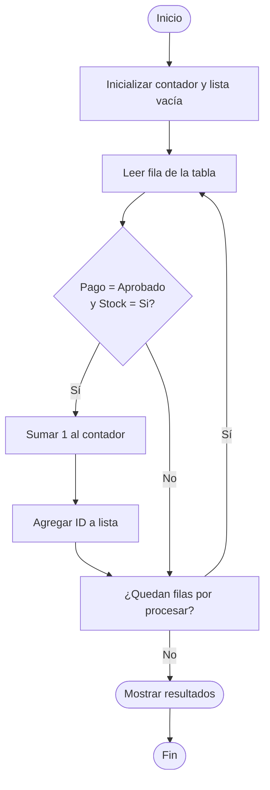

```mermaid
flowchart TD
    A([Inicio]) --> B[Inicializar contador y lista vacía]
    B --> C[Leer fila de la tabla]
    C --> D{Pago = Aprobado <br> y Stock = Si?}
    D -- Sí --> E[Sumar 1 al contador]
    E --> F[Agregar ID a lista]
    F --> G[¿Quedan filas por procesar?]
    D -- No --> G
    G -- Sí --> C
    G -- No --> H([Mostrar resultados])
    H --> I([Fin])
```
