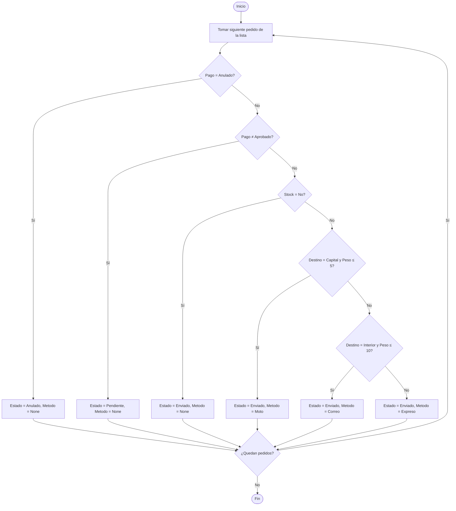
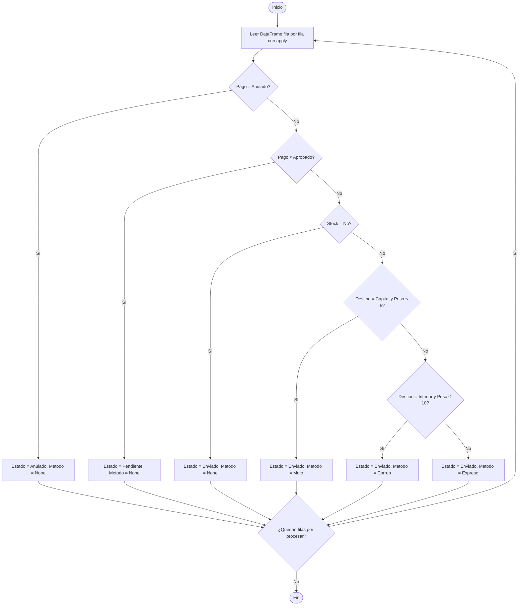

```mermaid
flowchart TD
    A([Inicio]) --> B[Tomar siguiente pedido de la lista]
    B --> C{Pago = Anulado?}
    C -- Sí --> D[Estado = Anulado, Metodo = None] --> G
    C -- No --> E{Pago ≠ Aprobado?}
    E -- Sí --> F[Estado = Pendiente, Metodo = None] --> G
    E -- No --> H{Stock = No?}
    H -- Sí --> I[Estado = Enviado, Metodo = None] --> G
    H -- No --> J{Destino = Capital y Peso ≤ 5?}
    J -- Sí --> K[Estado = Enviado, Metodo = Moto] --> G
    J -- No --> L{Destino = Interior y Peso ≤ 10?}
    L -- Sí --> M[Estado = Enviado, Metodo = Correo] --> G
    L -- No --> N[Estado = Enviado, Metodo = Expreso] --> G
    G{¿Quedan pedidos?}
    G -- Sí --> B
    G -- No --> O([Fin])
```

```mermaid
flowchart TD
    A([Inicio]) --> B[Leer DataFrame fila por fila con apply]
    B --> C{Pago = Anulado?}
    C -- Sí --> D[Estado = Anulado, Metodo = None] --> G
    C -- No --> E{Pago ≠ Aprobado?}
    E -- Sí --> F[Estado = Pendiente, Metodo = None] --> G
    E -- No --> H{Stock = No?}
    H -- Sí --> I[Estado = Enviado, Metodo = None] --> G
    H -- No --> J{Destino = Capital y Peso ≤ 5?}
    J -- Sí --> K[Estado = Enviado, Metodo = Moto] --> G
    J -- No --> L{Destino = Interior y Peso ≤ 10?}
    L -- Sí --> M[Estado = Enviado, Metodo = Correo] --> G
    L -- No --> N[Estado = Enviado, Metodo = Expreso] --> G
    G{¿Quedan filas por procesar?}
    G -- Sí --> B
    G -- No --> O([Fin])
```
